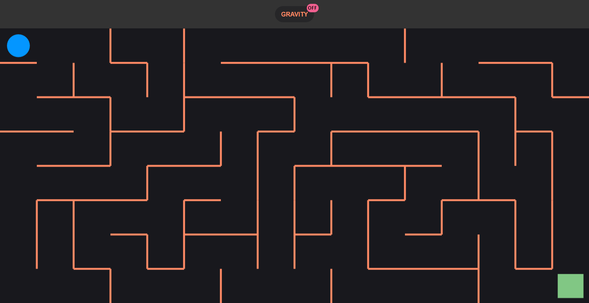

# Maze

Project from [Modern JavaScript Bootcamp](https://www.udemy.com/course/javascript-beginners-complete-tutorial)

Built with JavaScript and [Matter.js](https://brm.io/matter-js/)

### [Live Demo](https://mat2ja.github.io/maze-game/)

    Move with arrow-keys or WASD, toggle gravity with 'G'

